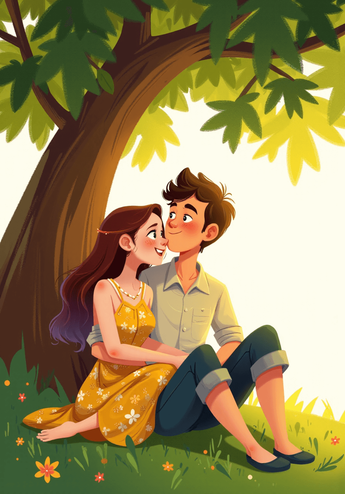

# 泽菲瑞亚的少女与影伴

在一个遥远而奇幻的国度，生活着一个勇敢美丽的女孩，名叫Jane。她曾游历四方，见识了无数令人惊叹的景象和奇妙的生物，然而最终，她选择回到自己温柔的小镇，过起了宁静的生活。

## 第一段：勇敢的冒险者

在一个遥远而奇幻的国度，黄昏的阳光洒落在安静的小镇上，Jane站在广场的边缘，微风轻拂着她金色的卷发，宛如流动的光辉。她穿着一袭淡蓝色的连衣裙，脚踏白色帆布鞋，显得既青春又自然。她的蓝色眼眸闪烁着冒险的渴求，尽管周围镇民在欢声笑语中，她的心却向往着辽阔的山脉与未知的奇遇。广场上孩子们的嬉闹声在空气中回荡，却无法掩盖她内心的躁动与期盼。每当视线跃向那远方的山丘，她坚定的信念就在心底燃起，似乎呼唤着她重启那段未完的旅程。

分镜描述：
1. 镜头一：小镇全景
+ 风格描述：时间在黄昏，夕阳的余晖洒在宁静的小镇上，空气中弥漫着淡淡的花香。小镇建筑以温暖的木材和红砖为主，错落有致，展现出几分乡村的闲适。
+ 画面视角：镜头俯瞰整个小镇，透出一片温暖的金色，显示出房屋的温馨和周围的绿树成荫。
+ 情感状态：尽管小镇静谧，但似乎隐隐传递着一种未了的渴望。

2. 镜头二：Jane的特写
+ 人物描述：Jane是一个中长金色卷发的女孩，头发在微风中轻轻摇曳。她的眼睛闪烁着热情而坚定的蓝色，脸颊微微红润，透露出健康的气息。她的鼻梁挺直，嘴角常挂着微笑，但目光中却透出几分忧伤和渴望。
+ 服装描述：她穿着一件淡蓝色的连衣裙，裙摆随着微风轻轻摆动，脚上是一双朴素的白色帆布鞋，简洁却不失青春的朝气。
+ 肢体动作：她双手轻轻抱在胸前，身体微微前倾，仿佛在倾听小镇的细语，眼中流露出对外面世界的牵挂。

3. 镜头三：小镇广场的互动
+ 人物描述：周围有其他镇民，衣着朴素，面带笑意，彼此交谈。孩子们在广场上追逐玩耍，偶尔传来银铃般的笑声。
+ 风格描述：和煦的阳光洒在地面，长影交错，温馨的场面令人生出归属感。
+ 情感状态：尽管Jane身处这样的欢乐场景中，但她的目光却时常投向远方，似乎在追寻那未曾探访的冒险。

4. 镜头四：Sky Line
+ 风格描述：镜头拉远，展现小镇边缘的壮丽山脉，天边云彩在日落时显得如火如荼，仿佛在呼唤着她的冒险欲望。
+ 情感状态：Jane的目光逐渐坚定，心中那股渴望的火焰在心底熊熊燃烧，似乎在召唤她再一次踏上旅途。

## 第二段：偶然的相遇

一天，沿着小镇幽静的小巷，Jane走进了唯一的咖啡馆（一个充满温馨与艺术气息的空间）。门口的藤蔓装点着墙面，阳光透过树叶的缝隙洒落在青石地面上，仿佛在为她的到来送上祝福。咖啡馆内，浓郁的咖啡香气与悠扬的音乐交织，营造出一个让人感到无比放松的氛围。当她的目光落在角落里的Tibbers身上时，彼此的眼神在瞬间就产生了共鸣。Tibbers有着一头黑色头发，穿着简约的白衬衫，流露出随意而温暖的气质。两人从工作的梦想聊到生活的哲学，轻松的氛围让她们的交流愈加深入，仿佛无话不谈。在渐渐暗淡的天色中，他们的笑声与讨论声为咖啡馆增添了一抹温暖的色彩，令周围的一切显得愈加宁静而美好。

分镜描述：
1. 镜头一：小巷入口
+ 风格描述：小巷显得幽静而温馨，墙面上爬满了绿色的藤蔓，阳光透过间隙洒落在青石铺成的地面上。微风轻拂，带来丝丝花香，给人一种宁静祥和的感觉。
+ 人物状态：Jane走在小巷中，脸上带着一抹淡淡的微笑，眼神中闪烁着期待，似乎在寻找着什么新的体验。
+ 情感状态：她的心中涌动着一丝兴奋，期待着即将遇见的陌生而温暖的世界。

2. 镜头二：咖啡馆内部
+ 风格描述：咖啡馆的内饰充满了温馨的木质感，墙壁上挂着各种装饰画，透出几分艺术气息。昏黄的灯光映衬着四周的环境，营造出浪漫而舒适的氛围。
+ 画面视角：镜头从门外缓缓推进，映入眼帘的是顾客们悠闲地品着咖啡，聊天轻松的情景。
+ 气味与声音：浓郁的咖啡香气与悠扬的音乐交织，让每位客人都在此享受那份宁静与愉悦。

3. 镜头三：初见Tibbers
+ 人物描述：Tibbers是一个有着乌黑头发的青年，脸上挂着淡淡的笑容，眉眼间透出几分灵动与聪慧。他穿着简约的白色衬衫，搭配深色工装裤，给人一种放松且随意的感觉。
+ 情感状态：他的神情显得友好而亲切，仿佛能轻易拉近人与人之间的距离，令Jane不自觉感到放松。
+ 肢体动作：两人相视而笑，Tibbers微微侧身，倾听着Jane的分享，偶尔点头回应，展现出对话的默契。

4. 镜头四：深入交谈
+ 风格描述：随着交谈的深入，咖啡馆窗外的天色逐渐暗淡，透过窗户可见灯光映照着两人的身影，显得格外温馨。
+ 情感状态：两人之间的交流变得愈加投机，脸上的笑容不断加深，眼神中流露出的理解与共鸣让黑夜变得愈加温暖。
+ 肢体动作：Jane轻松地摆动手指，时而做出强调，Tibbers则用手势和身体前倾的姿态展现着他的兴趣和倾听。

## 第三段：期待与失落

就在这愉快的交谈中，Tibbers突然站起身来，微微一笑，告诉Jane他必须回家，还有事情要做。那一瞬间，Jane的心中悄然涌上失落，意识到自己对这个年轻人知之甚少。她静静望着Tibbers优雅的身影，那卷曲的棕色头发在灯光下显得格外迷人，而他微微一倾的身姿又令人心动。随着Tibbers的离去，她低下头，手指无意识地滑过咖啡杯的边缘，愈加感受到与他的距离。尽管相约而坐的机会日渐增多，但每当夜幕降临，Tibbers匆匆告别的身影总是让她倍感惆怅，独自在咖啡馆角落的她，眼中流露出渴望与不舍的情感，期待着下一次相聚能打破心中那道无形的屏障。

分镜描述：
1. 镜头一：Tibbers起身告别
+ 人物状态：Tibbers轻轻站起身，脸上挂着温暖的微笑，但眼中透露出一丝不舍。他的身体略微前倾，似乎不愿离去，但又不得不做出告别的决定。
+ 情感状态：在这一瞬间，Jane的心中涌起一阵失落，眼神中闪过一丝失望，仿佛时间在此刻凝固，让她意识到这段关系的脆弱与未解的模糊。

2. 镜头二：Jane的思绪
+ 人物描述：Jane微微垂下头，咬着下唇，手指轻轻抚摩着咖啡杯的边缘，显得有些慌乱。她的金色卷发在低头时随意散落，遮住了半张脸，让人无法看清她的情感。
+ 情感状态：随着Tibbers的离去，心中的惆怅不断涌现，她才意识到自己对他的了解如此肤浅，也愈加渴望更深的联系。
+ 肢体动作：她的手无意识地转动咖啡杯，似乎想要从咖啡的温度中寻求一些安慰。

3. 镜头三：两人的再会
+ 风格描述：转场至日后的某个晚上，咖啡馆依旧热闹。窗外的夜色浓厚，星星点点的灯光让咖啡馆显得分外温馨。在这样优雅的环境中，两个熟悉的身影再次入镜。
+ 情感状态：尽管相聚的温暖能暂时驱散失落，但随着时间的推移，Jane的期待感和对Tibbers的好奇心愈发加深。

4. 镜头四：夜幕降临
+ 人物状态：夜幕降临时，Tibbers再次展现出匆忙的样子，他似乎很在意时间。他连连道歉，带着温暖的微笑与Jane告别。
+ 情感状态：Jane此时坐在那里，眼中充满不舍与期待，心中苦苦期待着有一天，能更深入地了解眼前这个迷人的青年。而此时的告别，却又像一道无法触碰的屏障，让她倍感惆怅。
+ 肢体动作：在告别的瞬间，Jane轻轻举起手，仿佛想要挽留什么，却又无能为力。

## 第四段：开启新篇章

几天后，Jane终于鼓起勇气，向Tibbers提出了请他带自己出去玩。那时，阳光透过咖啡馆的窗户洒在她的脸上，令她感到无比的温暖。她难掩内心的兴奋与期待，自信地盯着这位迷人的青年。Tibbers微微一笑，欣然答应，带着她去参观一场精彩的展览。在绚丽多彩的艺术作品中，他们沉浸在一起的欢声笑语中，感受着生活的丰富与美好。Tibbers有时逗趣，有时认真，令Jane忍不住笑出声来，俩人的默契不断加深。最后，临别时，在阳光下的温暖一拥，既是朋友间的亲密，也是他们心底那份默契与期待的升华。此刻，Jane心中涌起一阵温暖，期待着下一次与Tibbers的相聚，心中孕育着更多的冒险与体验。

分镜描述：
1. 镜头一：Jan的心意
+ 场景描述：几个日子过去，咖啡馆的角落依旧是Jane与Tibbers相聚的地方。窗外的阳光明媚，透过透明的窗玻璃洒落在她的身上。
+ 情感状态：Jane的内心愈加迫切，眼中闪烁着勇气与期待的光芒。她决定打破这种静止的局面，渴望用行动去追求更多的体验与冒险。

2. 镜头二：鼓起勇气
+ 人物状态：Jane微微咬着下唇，手指紧握着咖啡杯，心中掀起一阵波澜。她深吸一口气，抬起头对Tibbers露出微笑，语气中带着一丝期待与忐忑。
+ 肢体动作：当她邀请Tibbers带她出去玩时，那一瞬间，她的手轻轻抚上桌面，仿佛在为自己的决定增添了勇气。

3. 镜头三：展览之旅
+ 风格描述：转场至展览现场，明亮的灯光和富有艺术感的装置映入眼帘，热闹的气氛让环境充满了欢声笑语。画作和雕塑交错出一幅幅绚丽的景象，吸引着目光。
+ 情感状态：两人走在走廊中，笑声此起彼伏，脸上的笑容难以掩饰彼此的愉悦与期待。心灵的碰撞与共鸣让她们在艺术中得到了升华。

4. 镜头四：共享美好
+ 人物动态：他们一起品尝展览附近的小吃，Tibbers一边逗笑，一边将美食递给Jane，展现出轻松愉快的互动。Jane的脸颊带着笑容，眼神中透露出幸福与满足。
+ 情感状态：在这一刻，彼此的默契加深了，温暖的眼神交融在一起，让时光似乎在这一瞬间凝固。

5. 镜头五：温暖的拥抱
+ 结尾描述：时光飞逝，展览结束时，阳光透过枝叶洒耀在他们的身上。当分别的时刻来临，Tibbers温柔地将Jane揽入怀中，给予她一个温暖的拥抱。这个拥抱不仅仅是友谊的象征，更是彼此心灵的契合。
+ 情感状态：Jane的心中充满期待，眼中闪烁着新的希望与憧憬。随着Tibbers的离去，她微微眨眼，脸上挂着甜蜜的微笑，心里默默地期待着下一次的相聚。

## 第五段：突如其来的病痛

然而，快乐的时光并未持续太久。当Jane独自回到家后，突如其来的高烧伴随着剧烈的咳嗽席卷了她的身体，瞬间让她感到虚弱无力。黄昏的温暖光线未能驱散她心中的不安，反而让她的脸色愈加苍白。她靠着墙壁，额头布满细密的汗珠，无助的心情如同夜幕般沉重。而在咖啡馆中，Tibbers照常来到这里，却发现Jane的缺席让他心中泛起莫名的不安。起初，他努力镇定，但随着时间的推移，焦虑渐渐升腾，眉头紧锁。手指轻敲着桌面，他的目光不断投向门口，内心的焦虑愈发强烈。最终，他决定开始四处打听，向咖啡馆的老板询问着有关Jane的消息，以及她的住处，心中默默期待能找到她，确保她的安危，然而，焦急的情绪如同乌云一般笼罩着他。

分镜描述：
1. 镜头一：Jane的回家
+ 风格描述：黄昏的色调洒在小镇上，温暖的光影下一片宁静。Jane走在回家的路上，眼中仍闪烁着展览的美好回忆，脸上挂着满足的微笑。
+ 情感状态：然而，当她回到家中，一阵突如其来的不适席卷而来，幸福的回忆被忽然降临的病痛吞没，脸色瞬间变得苍白。

2. 镜头二：病痛发作
+ 人物状态：回到家中的Jane茫然四顾，随着高烧的突起，她的身体在瞬间感到无力，双手扶着墙壁，缓缓滑坐在地。额头布满细密的汗珠，眼神中充满了无助。
+ 情感状态：她的心中充满不安与孤独，面对突如其来的病痛，内心感到了一种无奈和脆弱。

3. 镜头三：夜晚的咖啡馆
+ 风格描述：夜晚悄然降临，咖啡馆依旧灯火通明，温暖的光线透出墙外，显得格外温馨。通常热闹的环境此刻却显得略显空旷，少了Jane的身影，显得有些冷清。
+ 人物状态：Tibbers来到咖啡馆，发现Jane缺席，面露不解，他坐在她常坐的角落中，眼神中满是不安与疑惑。

4. 镜头四：焦虑的Tibbers
+ 情感状态：起初，Tibbers表现得很镇定，尽量让自己不去想太多，但随着时间的推移，他的不安感愈发明显，眉头紧锁，心中开始隐隐作痛。
+ 肢体动作：他左右张望，手指轻敲桌面，时不时看向门口，期待Jane的到来，内心却开始焦躁不安。

5. 镜头五：寻找Jane
+ 人物状态：Tibbers开始四处打听，跟咖啡馆的老板交谈，询问有没有听说过Jane的事情。焦急而急切的语气让他显得有些不安。
+ 情感状态：他心中暗暗担心，脑海中不断浮现出Jane的笑容，越是担忧越是心痛，急切地想要找到她，确保她的安全。

## 第六段：不期而遇的真相

经过一番寻觅，Tibbers终于在Jane常去的餐馆打听到了她的住址，满怀期待与紧张地奔向她的家。当他推开门的瞬间，傍晚的余晖透过窗子洒落在昏暗的房间里，照亮了那张纤瘦却愈发苍白的脸庞。Jane已然处于半昏迷的状态，微弱的呼吸让Tibbers心如刀绞。他的心中难以抑制地悲痛，眼泪汹涌而出，流淌在他的脸颊上。当他观察着她日渐虚弱的身体，感觉到自己置身于一个绝境——他既想倾尽全力保护她，又被一种无法言说的身份所禁锢。作为一只小熊，他深知自己终将不得不远离这个人类世界，回归那片属于自己的森林。此时，凝视着她的眼神充满了爱与忧愁，他明白，无论如何，这份感情已经深深植根于他心底，难以抹去。

分镜描述：
1. 镜头一：Tibbers的寻找
+ 场景描述：在傍晚的微光中，Tibbers匆匆走过街道，周围的灯火逐渐亮起。他的眼神坚定而焦急，耳边是夜晚的阵阵虫鸣，增添了他内心的不安。
+ 情感状态：为了找到Jane，他赶往她常去的餐馆，心中充满了对失去时间的焦虑与绝望。

2. 镜头二：确认住址
+ 人物状态：在餐馆中，Tibbers向服务员询问，获得了Jane的住址。他在一瞬间感到释然，曲折而又艰难的寻找终于结束，但随之而来的紧迫感却坚定了他的脚步。
+ 肢体动作：他慢慢地抚摸着那张记下住址的纸条，心中暗暗祈祷，希望Jane能平安无事。

3. 镜头三：发现Jane
+ 风格描述：当Tibbers走入Jane的家中，傍晚的余晖透过窗子洒入房间，柔和的光线照亮了昏暗的空间。床上，Jane的身影显得那么瘦弱而孤单，呼吸微弱，脸色惨白，似乎在与无尽的昏迷抗争。
+ 情感状态：Tibbers的心在这一幕中悸动，他的眼泪濡湿了眼眶，无法自已地倾泻而下。他感到深深的痛苦与无助。

4. 镜头四：爱的抉择
+ 人物状态：Tibbers站在床边，目光紧锁着Jane，心中五味杂陈。他想要用尽全力保护这个他关心的女孩，但又明白自己的身份带来的限制与无奈。
+ 情感状态：面对她虚弱的身体与痛苦的表情，他在心中做着挣扎——是继续陪伴，还是尊重自己终将要面对的挑战？

5. 镜头五：隐秘的身份
+ 风格描述：随着Tibbers的思绪升起，镜头缓缓拉远，透露出他身上独特的特征——他是一只小熊，毛色柔和，眼神中透出智慧与温柔，却也掺杂着忧虑。
+ 情感状态：他意识到，自己始终都不能在人类社会中停留太久，早晚都要选择回归森林。此时，心中的矛盾与痛苦愈加加深。

## 第七段：守护与重生

即使在面对自己身份的困扰，Tibbers的内心依旧充满了对Jane的爱与关切。他在夜深人静时做出了一个决定，化身为柔软的小熊，彻夜守护在她的床边，温暖她的梦境，默默祈愿她能早日康复。随着时间的推移，黎明的光辉悄然降临，Jane终于在阳光的照耀下醒来。她先是茫然，然后焦急地四处寻找，最终目光停留在床边那只小熊身上，心中陡然涌起一阵惊讶。随着她意识到这个小熊就是一直在她身边的Tibbers时，深深的感动与幸福混杂在心尖，仿佛触碰到了生命的另一种可能。一瞬间，两人的目光交汇，相互之间的理解与情感愈发升华，犹如重生般充满了新的希望。

分镜描述：
1. 镜头一：爱的承诺
+ 场景描述：夜色渐深，房间里只剩微弱的光线，Tibbers静静坐在床边，一直守护着Jane。风轻轻拂过窗前，带动百叶窗轻轻作响，增添了几分温馨的氛围。
+ 情感状态：尽管内心充满挣扎，但他却只想专注于照顾眼前这个他深爱的女孩，目光中满是坚定与温柔。

2. 镜头二：Tibbers的转变
+ 人物状态：Tibbers在心中默念着“希望她能早日康复”，决定变回小熊的模样。他缓缓闭上眼睛，身体开始逐渐变化，黑白相间的毛发重新覆盖在身上，显得更加温暖而可爱。
+ 肢体动作：他温柔地趴在床边，静静看着Jane，为她带去自己的温暖，默默祈祷她的早日康复。

3. 镜头三：天亮时分
+ 风格描述：黎明的第一缕阳光透过窗帘洒入房间，顿时驱散了夜晚的阴霾。光线洒在趴在床边的小熊身上，映衬出一幅温馨的画面。
+ 情感状态：在这清新的早晨，Jane缓缓睁开眼睛，先是迷茫，随后渐渐清醒，四周的安静让她感到异常舒适。

4. 镜头四：意识的觉醒
+ 人物状态：Jane的目光落在床边的小熊身上，眼神中的疑惑逐渐转为惊讶。她努力回忆起那晚的点点滴滴，突然意识到眼前的这只小熊就是一直守护自己的Tibbers。
+ 情感状态：她心中涌起一阵惊喜与温暖，感受到从未有过的亲密与依赖，意识到他们之间的联系早已超越了常规。

5. 镜头五：守护与重生
+ 人物动态：Tibbers感受到Jane的目光，轻轻抬头，两人的目光相遇，Jane的心中充满了感动与 gratitude。她微微一笑，温暖的气息流淌在彼此之间，充满了新的希望。
+ 情感状态：这一刻，他们之间的距离似乎消失，心灵的相通让彼此感受到了一种重生的力量，仿佛预示着未来的美好与可能性。

## 第八段：坦诚的心

在闪烁的星空下，Tibbers小心翼翼地问道：“你会害怕我不是人类的真相吗？”夜空的深邃与周围的宁静交相辉映，令这个问题显得格外沉重。Jane的心中涌起一阵挣扎，她回想着与Tibbers相处的点滴，内心的情感在此刻交织，思索着这个特别青年的身份。最终，她抬起头，目光坚定而柔和，心中充满了爱的力量，清晰地说道：“我不怕。”这句话宛如晨曦中的第一缕光线，瞬间点亮了Tibbers的心灵，带来无尽的希望与温暖。他的脸上绽放出久违的笑容，内心的负担在瞬间解除，决定不再在夜晚匆匆离开。这个夜晚，不仅是坦诚的交流，也是彼此间心灵的契合，仿佛在星空之下编织了一幅新的画卷，描绘着未来的美好与无限可能。

分镜描述：
1. 镜头一：星空下的交流
+ 场景描述：夜空中繁星闪烁，涌动着光辉，仿佛为这段特殊的对话增添了一份神秘的氛围。窗外的微风轻轻吹拂，带来树叶的沙沙声，与屋内的温暖形成鲜明对比。
+ 情感状态：Tibbers坐在床边，心中满怀忐忑与期待，看着Jane，他的眼神中流露出一丝不安。

2. 镜头二：Tibbers的提问
+ 人物状态：Tibbers小心翼翼地开口，语气中透露出柔和的关切，“你会害怕我不是人类的真相吗？”他凝视着她，渴望得到一个肯定的答案。
+ 肢体动作：他微微前倾身体，手掌轻轻握成拳，暗示着他内心的紧张与不安。

3. 镜头三：Jane的挣扎
+ 情感状态：此时，Jane内心经历着一番挣扎，脑海中回忆起她与Tibbers相处的点点滴滴。她知道他的身份与众不同，但那种不可思议的爱意早已超越了外在的形式。
+ 人物状态：她的脸上浮现出认真而坚定的神情，深吸一口气，似乎在寻找内心的力量。

4. 镜头四：坚定的回答
+ 人物状态：经过片刻的沉思，Jane抬起头，目光坚定而温柔：“我不怕。”这句话如同晨曦中透来的第一缕光芒，点亮了Tibbers心底的希望。
+ 情感状态：她的声音坚决而清晰，仿佛将所有的忧虑一扫而空，令Tibbers感受到无与伦比的温暖。

5. 镜头五：希望的涌动
+ 人物动态：Tibbers感受到从未有过的轻松与愉悦，眼中闪烁着感激的光辉。他放下了心头的重担，微笑着回应Jane，决定不再夜晚匆匆离开。
+ 情感状态：这一刻，彼此间的距离似乎消失，连接的纽带更加深厚。星空下的承诺，带来了新的希望与可能。

## 第九段：新的生活

从此以后，Jane和Tibbers过上了幸福而甜蜜的生活。阳光明媚的白天，他们像恋人般享受彼此的陪伴，漫步在小镇的公园中，周围的花儿在微风中轻轻摇曳，洋溢着春天的气息。而夜幕降临时，Jane会将Tibbers小心翼翼地藏在书包里，一同前往热闹的夜市。街道两边五彩斑斓的灯光闪烁，香气四溢的小吃摊吸引着人们的光临。在这欢声笑语中，两人分享着彼此的梦想与故事，心灵在无数交流中交织在一起，默契如同音乐般和谐。无论是打闹嬉笑的时光，还是安静交谈的瞬间，他们共同编织出属于自己的奇幻故事，充满了爱的印记与未来的期待。这段新的生活让Jane感到前所未有的幸福，她知道，身边的这个小熊不仅是她的伴侣，更是她心灵深处永恒的守护者。

分镜描述：
1. 镜头一：幸福的白天
+ 场景描述：阳光明媚的午后，Jane和Tibbers并肩走在小镇的公园里，周围的花朵在风中摇曳，空气中弥漫着春天的芬芳。
+ 人物状态：Jane脸上洋溢着幸福的笑容，Tibbers则在她的身旁，显得温柔而专注。两人之间的互动自然流畅，仿佛世界上只剩下彼此。

2. 镜头二：夜市的乐趣
+ 风格描述：夜幕降临，小镇的夜市热闹非凡，五彩斑斓的灯光照亮了每一个角落，街边的小吃摊散发着诱人的香气，四周充满了欢声笑语。
+ 人物状态：Jane将Tibbers小心翼翼地藏在书包里，时不时向他投去微笑，Tibbers的黑白毛发在灯光下显得温暖可爱，吸引着路人的目光。

3. 镜头三：无数的交流
+ 情感状态：在游玩的过程中，Jane与Tibbers分享着彼此的故事与梦想，打闹嬉笑中，彼此的心灵在交流中愈发紧密，仿佛能够轻易读懂对方的思绪与情感。
+ 肢体动作：他们间或停下脚步，一起品尝美食，Jane用手指轻轻喂给Tibbers，而他则用眼神回应着，这样的互动让两人之间的情感愈加升温。

4. 镜头四：编织故事
+ 风格描述：夜市中，璀璨的星空下，两人坐在长椅上，分享着一盘热腾腾的甜点，周围的欢笑声似乎都在为他们的故事喝彩。
+ 情感状态：在这个美好的时刻，Jane与Tibbers彼此凝视，眼中满是欢喜与信任。她开始给他讲述她的梦想，而Tibbers则用在心里编织的故事回应，仿佛他们已经一起经历了无数的冒险。

5. 镜头五：属于他们的奇幻故事
+ 人物状态：随着时间的推移，两人之间的默契与信任不断加深，他们共同编织出属于自己的奇幻故事——从梦幻的冒险到甜蜜的日常，每一个瞬间都在他们的心中凝结成珍贵的回忆。
+ 情感状态：这种新的生活方式让Jane感到前所未有的幸福，她的心灵被这份深厚的情感所温暖，而Tibbers亦是在这段关系中找到归属与希望。

----

## 配图

    
    
    
    
    
    
    

